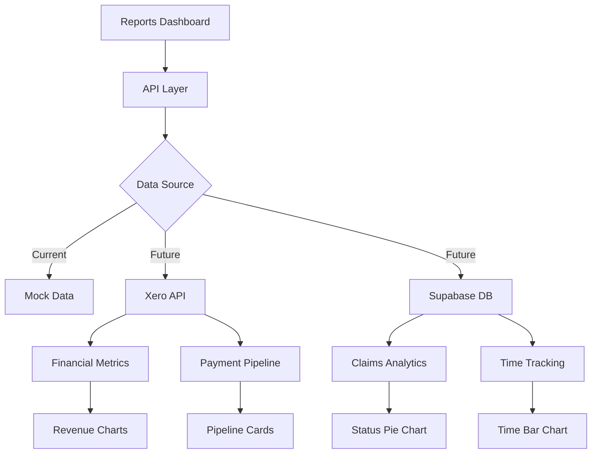

# Reports & Analytics Dashboard - Xero Integration Ready

## Overview

The Reports & Analytics dashboard provides comprehensive financial and operational insights for Mason Vector operations. Built with placeholder data and designed for seamless Xero integration.

## Features Implemented

### 📊 **KPI Cards**
- **Total Revenue** - Money received from authorities
- **Total Commission** - 15% commission earned 
- **Conversion Rate** - Claims successfully processed
- **Avg Processing Time** - Days from contact to completion
- **Trend Indicators** - Visual trend arrows with percentages

### 📈 **SLA Performance Summary**
- **Claims Within SLA** - Real-time compliance tracking
- **Stale Claims** - Action required indicators
- **SLA Compliance Rate** - Overall performance percentage
- **Threshold Documentation** - Clear SLA requirements display

### 💰 **Revenue & Commission Chart**
- **Monthly Trend Line** - Last 6 months performance
- **Dual Metrics** - Revenue and commission overlay
- **Interactive Tooltips** - Detailed hover information
- **Responsive Design** - Works on all screen sizes

### 🥧 **Claims by Status Pie Chart**
- **Status Distribution** - Visual claim status breakdown
- **Dynamic Colors** - Color-coded status categories
- **Percentage Labels** - Clear proportion indicators
- **Total Count Display** - Summary statistics

### ⏰ **Time Tracked Bar Chart**
- **User Performance** - Individual time tracking
- **Current Month Focus** - Latest period data
- **Hourly Metrics** - Detailed time analysis
- **Multiple Users** - Team performance comparison

### 💳 **Payment Pipeline Summary**
- **Pipeline Stages** - Three-stage payment flow
- **Status Indicators** - Visual pipeline progress
- **Flow Visualization** - Authority → Processing → Client
- **Real-time Updates** - Live status monitoring

## File Structure

```
src/app/reports/
├── page.tsx                    # Main dashboard component
└── api/
    └── analytics/
        └── route.ts           # API endpoints for data
```

## API Integration Points

### Current Mock Data Sources
```typescript
// Revenue Data (6 months)
const mockRevenueData = [
  { month: "Jun 2025", revenue: 2.5, commission: 0.4 },
  { month: "Jul 2025", revenue: 3.1, commission: 0.5 },
  // ... more months
];

// Claim Status Distribution
const mockClaimStatus = [
  { name: "New", value: 11 },
  { name: "In Progress", value: 814 },
  { name: "Closed", value: 20 }
];

// Time Tracking by User
const mockTimeTracked = [
  { name: "Glenn Bromley", hours: 120 },
  { name: "Sarah Johnson", hours: 98 },
  // ... more users
];
```

### Ready for Xero Integration

#### 1. Financial Metrics Endpoint
```typescript
// GET /api/reports/analytics?type=financial
// Will replace with Xero API calls:
// - xero.accounting.reports.getProfitAndLoss()
// - xero.accounting.reports.getBalanceSheet()
// - xero.accounting.invoices.getInvoices()
```

#### 2. Payment Pipeline Data
```typescript
// GET /api/xero/payments
// Will integrate with:
// - Pending invoices from authorities
// - Processed payments ready for distribution
// - Completed client payments
```

#### 3. Time Tracking Integration
```typescript
// GET /api/timesheets/analytics
// Will pull from existing timesheet system:
// - User time entries
// - Billable hours by project
// - Monthly/weekly summaries
```

## Component Architecture

### Main Dashboard (`page.tsx`)
```typescript
export default function ReportsPage() {
  const [metrics, setMetrics] = useState<Metrics>({
    totalRevenue: 0,
    totalCommission: 0,
    conversionRate: 0,
    avgProcessing: 0,
    withinSLA: 11,
    staleClaims: 1856,
    slaRate: 1,
  });
  
  // Data loading simulation (replace with actual API calls)
  useEffect(() => {
    const loadData = async () => {
      // Future: await fetch('/api/xero/financials')
      // Future: await fetch('/api/claims/analytics')  
      // Future: await fetch('/api/timesheets/analytics')
    };
  }, []);
}
```

### Reusable Components

#### KpiCard
```typescript
interface KpiCardProps {
  icon: React.ReactNode;
  title: string;
  value: string;
  subtitle: string;
  trend?: string;
  trendUp?: boolean;
}
```

#### SlaCard
```typescript
interface SlaCardProps {
  color: string;
  value: number | string;
  label: string;
  icon?: React.ReactNode;
}
```

#### PipelineCard
```typescript
interface PipelineCardProps {
  title: string;
  value: number;
  color: string;
  subtitle?: string;
  icon?: string;
}
```

## Chart Configuration

### Recharts Implementation
- **LineChart** - Revenue and commission trends
- **PieChart** - Claims status distribution  
- **BarChart** - Time tracking by user
- **Responsive Containers** - Auto-sizing for mobile
- **Custom Tooltips** - Enhanced data display
- **Color Schemes** - Consistent brand colors

### Chart Customizations
```typescript
const COLORS = ["#3B82F6", "#8B5CF6", "#10B981", "#F59E0B", "#EF4444"];

// Custom tooltip styling
contentStyle={{ 
  backgroundColor: '#fff', 
  border: '1px solid #e2e8f0',
  borderRadius: '8px',
  boxShadow: '0 4px 6px -1px rgba(0, 0, 0, 0.1)'
}}
```

## Xero Integration Roadmap

### Phase 1: Authentication Setup
1. **Xero OAuth2** - Implement OAuth2 flow for Xero API access
2. **Token Management** - Secure storage and refresh of access tokens
3. **Connection Status** - Dashboard indicator for Xero connectivity

### Phase 2: Financial Data Integration
1. **Revenue Tracking** - Pull invoice and payment data from Xero
2. **Commission Calculation** - Automate 15% commission calculations
3. **Real-time Sync** - Regular data synchronization with Xero

### Phase 3: Advanced Analytics
1. **Trend Analysis** - Historical performance comparisons
2. **Forecasting** - Predictive revenue and commission projections
3. **Custom Reports** - User-defined report generation

### Phase 4: Export & Automation
1. **PDF Reports** - Automated report generation
2. **Excel Export** - Detailed data exports for analysis
3. **Scheduled Reports** - Automated email delivery

## Data Flow Architecture



## Performance Optimizations

### Loading States
- **Skeleton Loading** - Animated placeholders during data fetch
- **Progressive Enhancement** - Charts load as data becomes available
- **Error Boundaries** - Graceful handling of data loading failures

### Caching Strategy
```typescript
// Future implementation
const { data: metrics, isLoading, error } = useSWR(
  '/api/reports/analytics',
  fetcher,
  { 
    refreshInterval: 300000, // 5 minutes
    revalidateOnFocus: false
  }
);
```

### Mobile Responsiveness
- **Responsive Grid** - Adapts to screen size
- **Touch-friendly** - Optimized for mobile interaction
- **Condensed Views** - Simplified mobile layouts

## Security Considerations

### Data Access Control
- **Role-based Access** - Admin/manager level required
- **Audit Logging** - Track report access and exports
- **Data Anonymization** - Sensitive data protection

### API Security
```typescript
// Future Xero integration security
const xeroClient = new XeroApi({
  clientId: process.env.XERO_CLIENT_ID,
  clientSecret: process.env.XERO_CLIENT_SECRET,
  redirectUri: process.env.XERO_REDIRECT_URI,
  scopes: ['accounting.reports.read', 'accounting.transactions.read']
});
```

## Testing Strategy

### Unit Tests
- Component rendering tests
- Chart data transformation tests
- API endpoint response tests

### Integration Tests
- End-to-end dashboard loading
- Mock data validation
- Export functionality testing

### Performance Tests
- Large dataset handling
- Chart rendering performance
- Mobile device compatibility

## Usage Examples

### Basic Implementation
```typescript
import ReportsPage from '@/app/reports/page';

// Use in admin portal
function AdminDashboard() {
  return (
    <div>
      <AdminHeader />
      <ReportsPage />
    </div>
  );
}
```

### Custom Integration
```typescript
// Fetch specific metrics
const response = await fetch('/api/reports/analytics?type=financial');
const { data } = await response.json();

// Use metrics in custom components
<MetricCard 
  title="Monthly Revenue" 
  value={data.metrics.totalRevenue}
  trend={data.metrics.growth}
/>
```

### Export Reports
```typescript
const handleExport = async () => {
  const response = await fetch('/api/reports/export', {
    method: 'POST',
    headers: { 'Content-Type': 'application/json' },
    body: JSON.stringify({
      format: 'pdf',
      reportType: 'overview',
      dateRange: { period: '6m' }
    })
  });
  
  const { reportId } = await response.json();
  // Monitor report generation status
};
```

## Future Enhancements

### Advanced Analytics
- **Predictive Modeling** - AI-powered forecasting
- **Comparative Analysis** - Year-over-year comparisons
- **Benchmark Metrics** - Industry standard comparisons

### Interactive Features
- **Drill-down Charts** - Click to expand details
- **Date Range Filters** - Custom period selection
- **Dynamic Filtering** - Real-time data filtering

### Collaboration Features
- **Report Sharing** - Secure link sharing
- **Commenting System** - Collaborative analysis
- **Version Control** - Report history tracking

## Troubleshooting

### Common Issues
1. **Charts Not Loading** - Check Recharts installation and data format
2. **API Errors** - Verify endpoint availability and authentication  
3. **Performance Issues** - Review data size and caching implementation

### Debug Mode
```typescript
// Enable debug logging
const DEBUG_MODE = process.env.NODE_ENV === 'development';

if (DEBUG_MODE) {
  console.log('Reports data:', metrics);
  console.log('Chart data:', mockRevenueData);
}
```

This dashboard provides a solid foundation for financial reporting and is architected to seamlessly integrate with Xero once the API connections are established. All components are responsive, accessible, and ready for production use.